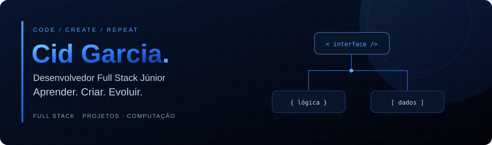
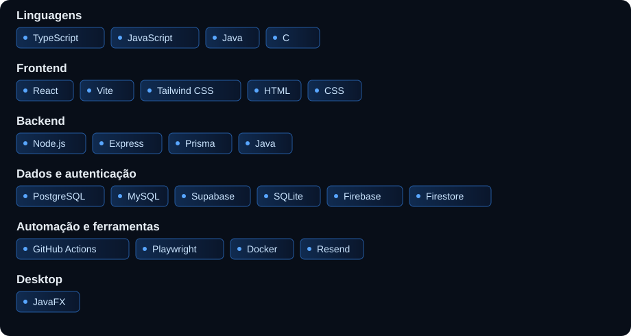

  

  <strong>Desenvolvedor Full Stack Júnior · Engenharia de Computação / UNIVASF</strong> 
  Desenvolvimento de sistemas para gestão, logística e operação

  <a href="https://github.com/Cidgarcia?tab=repositories">Explorar meus projetos ↗</a>

## Olá, eu sou o Cid.

Sou o Cid, estudante de **Engenharia de Computação na UNIVASF**. Gosto de criar aplicações que resolvem problemas do dia a dia e de aprender colocando ideias em prática.

Por aqui estão os projetos que desenvolvi, de sistemas de gestão a aplicações web. Também quero explorar automações, LLMs e chatbots nos próximos projetos.

## Projetos em destaque

### 01 / Garcia Turismo
**Gestão financeira e operacional para transporte de passageiros**

Desenvolvi uma aplicação web para centralizar veículos, viagens, abastecimentos, despesas e pagamentos de funcionários. O projeto reúne relatórios mensais em PDF com envio por e-mail e backups automatizados e criptografados.

A autenticação usa Firebase Authentication e os dados ficam no Cloud Firestore, com regras de acesso, isolamento por empresa e metadados para rastreabilidade. As rotinas de relatórios e backups são automatizadas com GitHub Actions.

**Stack:** HTML · CSS · JavaScript modular · Node.js · Firebase Authentication · Cloud Firestore · Playwright · Resend · GitHub Actions

[Explorar repositório ↗](https://github.com/Cidgarcia/garcia-turismo)

### 02 / Evento 360
**Eventos, inscrições e controle de vagas**

Aplicação web desenvolvida em equipe na disciplina de Engenharia de Software 3, com catálogo de eventos, áreas de organizador e participante, inscrições e check-in.

O sistema controla vagas, evita inscrições duplicadas e promove automaticamente participantes da lista de espera quando uma vaga é liberada. Inclui recuperação de senha, confirmação por e-mail com Resend e webhook opcional para automações com n8n.

**Stack:** React · Vite · Tailwind CSS · Node.js · Express · TypeScript · PostgreSQL · Prisma · Docker

[Explorar repositório ↗](https://github.com/sth4rley/evento360)

### Outros projetos importantes

| Projeto | Aplicação | Tecnologias |
| :--- | :--- | :--- |
| [Gestão de Academia](https://github.com/Cidgarcia/Sistema-de-Gestao-de-Academia) | Gestão de academia em uma aplicação desktop. | Java 17 · JavaFX · SQLite · Observer |
| [Controle de Cascos](https://github.com/Cidgarcia/controle-cascos) | Controle de vasilhames da Distribuidora Garcia. | JavaScript · HTML · CSS · Backend |

## Stack

## Direção de desenvolvimento

O Evento 360 inclui um webhook opcional para integrações com n8n, com eventos de inscrição, lista de espera e promoção de participantes. Quero explorar também chatbots e integrações com LLMs nos próximos projetos.

## Trocar uma ideia?

Estou aberto a oportunidades de estágio ou desenvolvimento júnior. Você pode falar comigo por aqui:

**E-mail:** [cidgarcia@gmail.com](mailto:cidgarcia@gmail.com)  
**LinkedIn:** [linkedin.com/in/cidgarcia](https://www.linkedin.com/in/cidgarcia/)  
**GitHub:** [Conheça meus repositórios](https://github.com/Cidgarcia?tab=repositories)

---

Entender o problema. Construir a solução. Evoluir com cada entrega.

